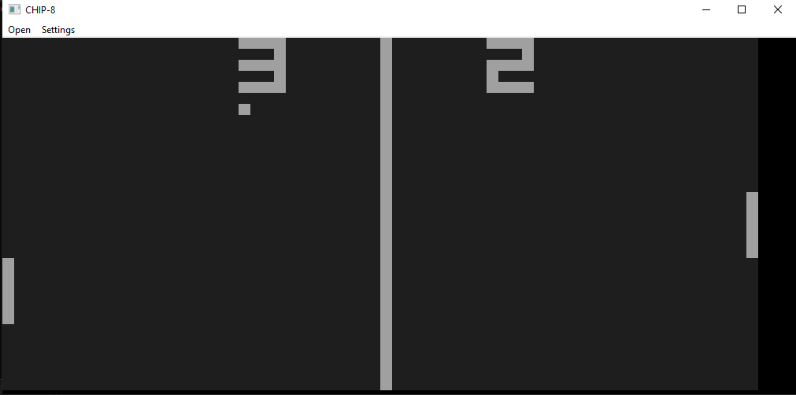
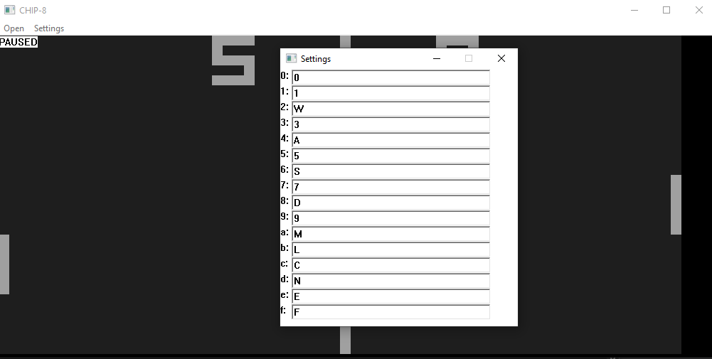
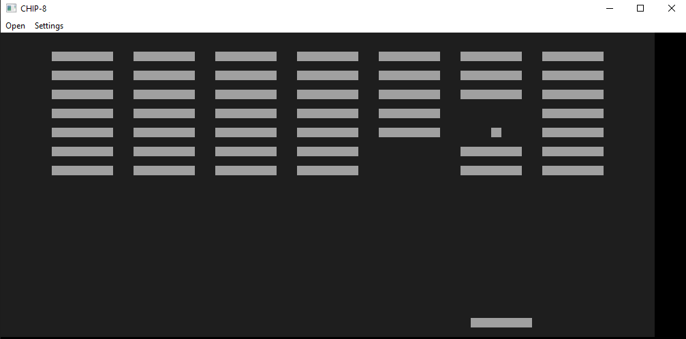

# Win-8 

A CHIP-8 Emulator written entirely in C++ with WIN32 API and DirectSound. No dependencies or libraries.

#### NOTE!

Only supports the original COSMAC CHIP-8 as of now. Games for other versions may or may not work.

# Screenshots

Pong

Custom Keybinds

Breakout

